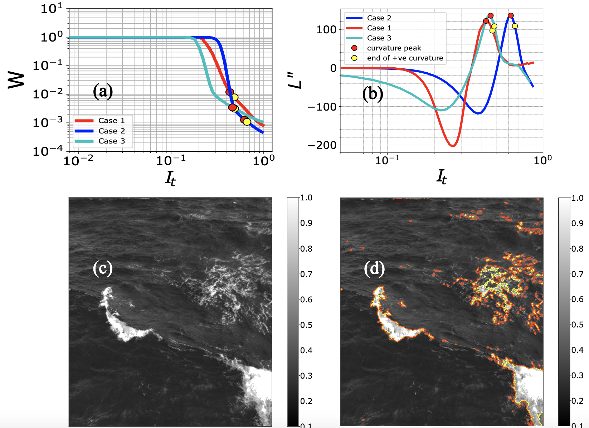

## The Wave-Breaking Kinematics code - $\Lambda(c, \theta)$ 

[Bernard Akaawase](https://marinesciences.uconn.edu/person/bernard-akaawase/), [Leonel Romero](https://marinesciences.uconn.edu/person/leonel-romero/), and [Alvise Benetazzo](http://www.ismar.cnr.it/people/benetazzo-alvise?set_language=en&cl=en). Observations of Wave-Breaking Direction and Energy Spread. - Geophysical Research Letters, 2025. 
## <p align="center" style="font-size: 40 px; color: red;"> ----| OUTPUT |---- </p>

<div align="center">
    
</div>

## Abstract 
Surface waves are important for remote sensing, air-sea exchange, and underwater acoustics. 
The short gravity wave spectrum is azimuthally broad and bimodal. However, widely used wave models fail to reproduce the degree of observed spreading and azimuthal bimodality. 
Recent studies show that an azimuthally narrow spectral breaking dissipation due to long-wave short-wave modulation significantly improves model performance, highlighting the importance of better understanding the directionality of breaking kinematics.
We utilized visible stereo imagery to investigate the directional wave-breaking kinematics relative to the energy spectrum under aligned and misaligned winds and dominant waves.
The results show that the statistical distribution of wave-breaking kinematics closely aligns with the direction of the dominant waves and is azimuthally unimodal and narrower than the bimodal energy spectrum. 
These findings confirm the importance of exploring the directionality of breaking to improve our understanding of the spectral energy balance and spectral wave models within the short-gravity range.

## How to use the code:

Start by making a local copy of this repository by either downloading the zipped files or cloning with:

``` 
git clone https://github.com/akaawase-bernard/WaveBreakingKinematics.git
```

After cloning, the directory tree on your machine should look like this:
```
WaveBreakingKinematics/
├── data
│   ├── ij2xy_mapping_data
│   ├── loc_output
│   └── optical_flow_data
|
├── code
│   ├── auxiliary
│   │    ├── detector.py
|   |    ├── imgs_background_removal.py
|   |    └── determine_brightness_threshold.ipynb
│   │    
│   │    
│   └── breaking_kinematics_algorithm.ipynb
│        
│        
└── figs
```
Next, navigate into the directory `cd ./WaveBreakingKinematics/` and create a virtual environment (optional). You can use python virtual environment [venv](https://docs.python.org/3/library/venv.html#creating-virtual-environments) or [conda](https://anaconda.org/) as demostrated below. The dependencies are listed in the WaveBreakingKinematics config file (`wbk.yml`)   
```
conda env create --file wbk.yml
``` 
then activate the environment with  
```
conda activate wbk
```
Once the environment is done building, launch the jupyter notebook:
```
jupyter-lab
```
This will start a Jupyter notebook in a browser window.

Before running the code, lets familiarize with the content. 
1. The data needed to test the code is available in the ` data/` directory. The main output of this code, which is the $\Lambda(c)$ data is saved in the `data/loc_output/` folder.
2. In the `figs/` you will find all the plots generated while running the code. About 10 figures are made per frame.
3. The demo of the wave breaking detection and kinematics calculation is given in this notebook `cd ./code/breaking_kinematics_algorithm.ipynb`. Ideally, before running this script, you ought to have prepared the images with the `imgs_background_removal.py`script. Followed by the brightness thresholding `determine_brightness_threshold.ipynb`. Both scripts are in the `./code/auxiliary/` directory.
The results of the 3 datasets are given below.
<div align="center">
    
</div>


 NB: To run the test cases, we have provided the outputs of the required steps.

## Run Test Cases
After activating your wbk environment, you can run the main script `./code/breaking_kinematics_algorithm.ipynb`. Ten (10) figures corresponding to the principal steps will be made and saved in the figs folder. Presently, the figs are occupied by our processing results.

## ... 

The raw stereo record used for analysis in our paper can be downloaded [here](https://data-dataref.ifremer.fr/stereo/AA_2015/2015-03-05_10-35-00_12Hz/). You will need only the [input](https://data-dataref.ifremer.fr/stereo/AA_2015/2015-03-05_10-35-00_12Hz/input/) and [config](https://data-dataref.ifremer.fr/stereo/AA_2015/2015-03-05_10-35-00_12Hz/config/) files. 

The 3D reconstruction of ocean surface waves was carried out with [WASS](https://sites.google.com/unive.it/wass/software/wass), to get WASS running on your machine, kindly follow these [instructions](https://sites.google.com/unive.it/wass/software/wass/getting-started?authuser=0). 

The horizontal translation of whitecaps was estimated with [Optical Flow]([https://pivlab.blogspot.com](https://docs.opencv.org/3.4/d4/dee/tutorial_optical_flow.html)).

##### Correspondence 
<bernard.akaawase@uconn.edu>


# How to cite this code

If you wish to use the code from this repository, you may cite it as: 

[....]. 

